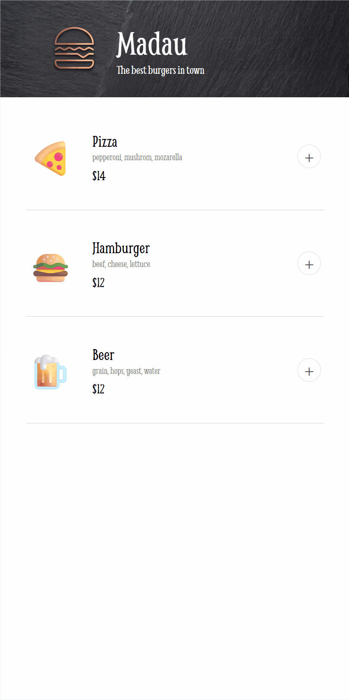

# Restaurant Project

A simple frontend for a restaurant ordering app developed using vanilla Javascript.

---

## 📸 Preview



---

## ✨ Features

- Add products
- Remove produts from order
- Enter payment details
- Order your food

---

## 🛠️ Built With

- HTML5
- CSS3
- Javascript

---

## 📚 What I Learned

During this project I practiced:

- Rendering UI dynamically from JavaScript objects.
- Adding an event listener to the document and using data attributes to identify the button being pressed.
- Hiding and showing modals appropiately.
- Preventing the default behaviour when sumbitting forms.
---

## 🔮 Future Improvements

- Making the website responsive (create a desktop version).
- Using images instead of emojis for products.
- Creating a more suitable credit card format.

---


## 🚀 Getting Started

Clone the repository

```bash
git clone https://github.com/incarasa/Restaurant-App-Frontend.git
```

Open the project with Live Server.